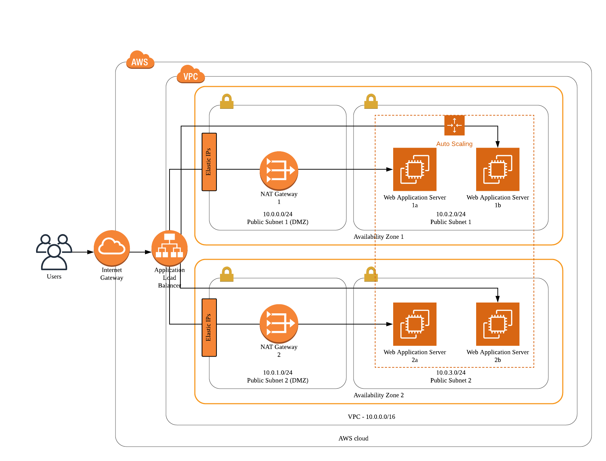

# Deploy a High-availability Web Application using CloudFormation


## Infrastructure Diagram



## Helper Scripts

```bash
# Create a CloudFormation stack
$ create.sh [stack-name] [template-body filepath] [parameters filepath]

# Update an existing CloudFormation stack
$ update.sh [stack-name] [template-body filepath] [parameters filepath]
```

## How to Deploy


### 1. Prerequisite

You will need to install and set up AWS CLI at first to run scripts.


### 2. Create IAM Role

`$ sh create.sh udagram-role role.yml role-parameters.json`

This script will create an IAM role `UdagramRole` with S3-ReadOnly Access.


### 3. Create Network

`$ sh create.sh udagram-network network.yml network-parameters.json`

This script will setup a VPC, gateways (IGW and NAT), subnets and routings.

There will be two Availability Zones, each contains
- a public subnet as DMZ
- a private subnet for servers


### 4. Deploy Web Application

`$ sh create.sh udagram-server servers.yml server-parameters.json`

This script will create 4 servers (Ubuntu 18, t3.medium), two located in each private subnet.
All servers will be in the same auto-scaling group.
